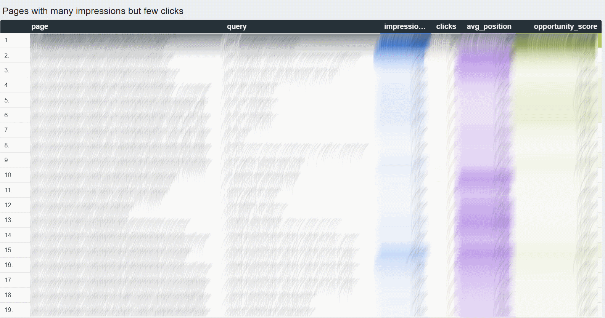
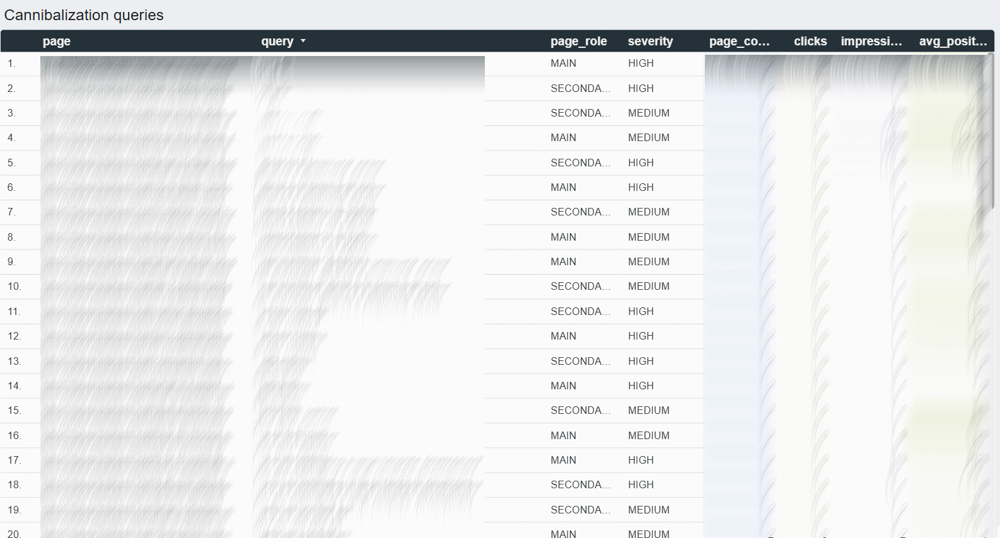
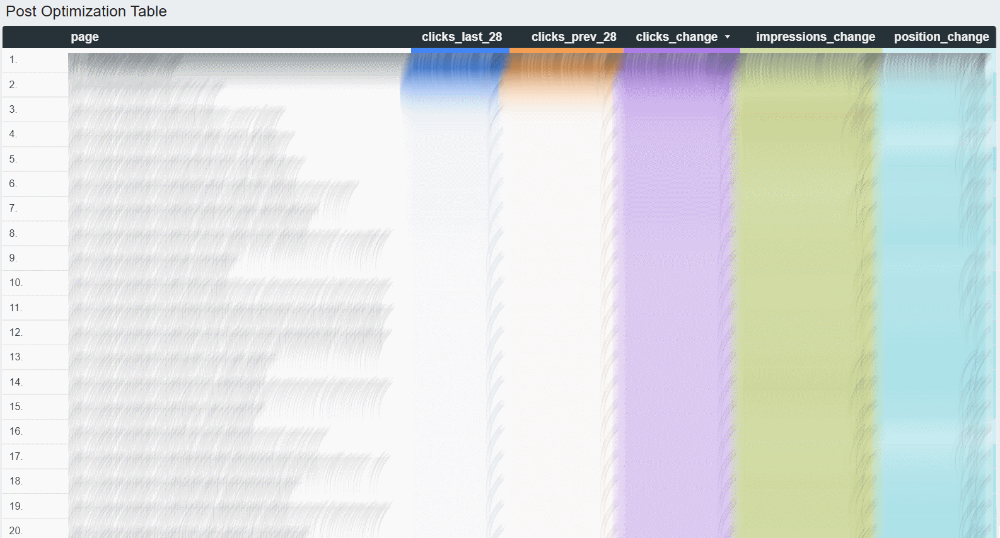

# GSC Organic Traffic Intelligence Dashboard



A portfolio SEO analytics project that transforms Google Search Console data into a BigQuery data model and a Looker Studio dashboard for analyzing organic growth opportunities, keyword cannibalization, and page momentum.

## Project Overview

This project was built to move beyond basic Google Search Console exports and create a reusable SEO analytics workflow.

The pipeline extracts raw Search Console data with Python, stores it in BigQuery, transforms it with SQL, and visualizes insights in Looker Studio.

The dashboard focuses on three practical SEO use cases:

- finding keyword and page opportunities with strong growth potential
- detecting keyword cannibalization across multiple URLs
- identifying pages gaining or losing organic visibility over time

## Tech Stack

- Python
- Google Search Console API
- Google BigQuery
- SQL
- Looker Studio

## Data Flow

Google Search Console API → Python export → BigQuery raw table → SQL transformation tables → Looker Studio dashboard

## Repository Structure

```text
python/
  gsc_export.py

sql/
  01_keyword_daily_metrics.sql
  02_page_daily_metrics.sql
  03_keyword_page_pairs.sql
  04_keyword_cannibalization_final.sql
  05_seo_opportunity_scores.sql
  06_page_momentum_summary.sql

images/
  opportunity-finder.png
  cannibalization-report.png
  page-momentum.png
```

## Main Components

### 1. Data Extraction (Python + GSC API)

The project uses a Python script to extract search performance data from the Google Search Console API.

The export includes:
- queries
- pages
- clicks
- impressions
- CTR
- average position
- date, device, and country dimensions

This allows flexible and repeatable data collection beyond the GSC interface limitations.

---

### 2. Data Storage (BigQuery)

Raw data is stored in BigQuery and serves as the foundation for all transformations.

The dataset is structured to support scalable analysis and can be updated incrementally.

---

### 3. Data Transformation (SQL)

Several SQL models are used to transform raw data into actionable datasets:

- keyword_daily_metrics → tracks keyword trends over time  
- page_daily_metrics → tracks page performance  
- keyword_page_pairs → maps queries to pages  
- keyword_cannibalization_final → identifies competing pages  
- seo_opportunity_scores → highlights optimization opportunities  
- page_momentum_summary → compares performance across time periods  

---

### 4. Data Visualization (Looker Studio)

The transformed data is visualized in Looker Studio dashboards designed for SEO decision-making.

The dashboard includes:

- Opportunity Finder  
- Cannibalization Report  
- Page Momentum Analysis

These views help prioritize SEO actions based on real performance data.

#### Opportunity Finder


#### Cannibalization Report


#### Page Momentum

